# YeahBuddy Web

En este proyecto se abordará la creación y el manejo de una web dedicada a la actividad física. En ella se podrá registrar/loggear usuarios, y registrar un CRUD de ejercicios y combinarlos en rutinas (también con un CRUD).

Cada usuario será libre de crear tantos ejercicios como rutinas desee. Los ejercicios serán comunes para todos los usuarios, pero las rutinas serán solo visibles para el usuario loggeado, es decir, serán privadas.

## ÍNDICE

- [TECNOLOGÍAS USADAS](#tecnologías-usadas)
    - [REACT](#react)
    - [APPWRITE](#appwrite)
        - [BASE DE DATOS](#base-de-datos)
        - [OTRAS HERRAMIENTAS](#otras-herramientas)
            - [SWEETALERT 2](#sweetalert-2)
            - [REACT ROUTER DOM](#react-router-dom)
            - [TAILWIND](#tailwind)
            - [VITE](#vite)
- [ESTRUCTURA](#estructura)
    - [BACKEND](#backend)
        - [AUTHCONTEXT.JSX](#authcontextjsx)
        - [SERVICES](#services)
        - [APP.JSX](#appjsx)
        - [NAVBAR](#navbar)
        - [LOGIN](#login)
        - [REGISTER](#register)
        - [EJERCICIOS Y RUTINAS PAGE](#ejercicios-y-rutinas-page)


## TECNOLOGÍAS USADAS


### REACT

El proyecto se centrará en REACT para el apartado visual y la conexión con el back-end.

### APPWRITE

Se empleará esta API para gestionar la base de datos. A ella nos conectaremos desde REACT vía API.


### BASE DE DATOS

La estructura de la base de datos se divide en las siguientes tablas:

- perfilUsuario: En ella almacenaremos nombre, email, contraseñas y características físicas del usuario.
- ejercicios: En esta tabla se van a guardar todos los ejercicios que creen los usuarios. Serán visibles para todos, así que se ruega compromiso y responsabilidad.
- rutinas: Con los ejercicios creados, cada usuario podrá crearse rutinas de entranamiento combinando esos ejercicios. Aquí cada usuario solo podrá acceder a sus rutinas.

### OTRAS HERRAMIENTAS

#### SweetAlert 2

Para la gestión de ventanas emergentes se emplea esta librería. El objetivo es reducir la construcción de componentes reutilizables como ventanas o modales, que puedan sobrecargar la arquitectura del proyecto. Además, SweetAlert ofrece ventanas emergentes mucho más ligeras y sencillas de escribir que un modal completo e independiente. Es cierto que tiene muchas más limitaciones que un modal propio, pero para el objetivo del proyecto es una alternativa perfecta.

Para su instalación en desarrollo se emplea:

```bash
npm install sweetalert2
```

Luego, en su empleo, siempre habrá que importar el módulo:

```javascript
import Swal from 'sweetalert2'
```

En el siguiente ejemplo, vamos a implementar un aviso para cuando las contraseñas introducidas en un registro de usuario no son similares:

```javascript
if(formData.password !== formData.confirmPassword){ // Si la contraseña y la repetición de la misma no coincide...
    Swal.fire({ // ...se lanza el modal
        icon: 'error', // icono que ofrece sweetAlert
        title: 'Error', // titulo del modal
        text: 'Las contraseñas deben ser iguales', // contexto
        background: '#2A2A2A',
        color: '#fff',
        confirmButtonColor: '#DC2626'
    });
    return;
}
```

#### React Router Dom

Esta es una librería para enrutamiento y poder definir la navegación entre las páginas.

Para su instalación:

```bash
npm install react-router-dom
```

En la construcción del proyecto se emplearon los siquientes elementos:

- BrowserRouter: Envuelve toda la aplicación para habilitar el enrutamiento basado en URLs del navegador.
- Routes y Route: Define las rutas de la aplicación y qué componente renderizar en cada una.
- Link: Crea enlaces de navegación sin recargar la página.
- Navigate: Redirige programáticamente a otra ruta.

#### Tailwind

Para los estilos de la web se elije esta librería. El principal motivo es la familiaridad con la misma y seguir poniendo en práctica y en mejora continua los conocimientos sobre la misma.

> [!NOTE]
> Puesto que los estilos de la página son bastante sencillos no voy a desarrollar mucho más el uso de los estilos.

#### Vite

Como herramienta de construcción se usa Vite. Este nos permite crear el proyecyo y arrancar el servidor con una mayor rapidez. Así como reflejar instantaneamente los cambios que se hagan en el proyecto. A parte que cabe señalar que React aconseja usar vite...

Para arrancar el proyecto:
```bash
npm run dev
```

## ESTRUCTURA

En el proyecto se ha usado una organización que permita separar lógica (conexión con la API), vistas principales y componentes reutilizables.

### BackEnd 

> [!NOTE]
> "BackEnd"

Toda la gestión con el back se ha dividido en los ficheros:

#### appwrite.js

Aquí están las variables de entorno para conectarnos con la api. Este fichero debería estar en el *gitignore*, pero se mantiene en el repositorio para las pruebas y evaluación.

#### AuthContext.jsx

Este fichero gestiona el estado de la autenticación del usuario dentro de la aplicación. La ventaja de este fichero es que cada componente puede acceder a él, sin necesidad de replicar la lógica en cada componente por separado. Esto es posible a la siguiente función:

```javascript
export function AuthProvider({children}){...}
```

Este componente permite encapsular el main de la aplicación de modo que la autenticación esté presente en toda la web:

```javascript
createRoot(document.getElementById('root')).render(
  <React.StrictMode>
    <AuthProvider>
      <App />
    </AuthProvider>
  </React.StrictMode>,
```

Dentro del componente almacena los datos del usuario en *localStorage* y permite acceder a ellos para continuar con la sesión iniciada.

A continuación se declaran las funciones de *login* y *register*.

Logout permite al usuario identificarse en la web, pasando como parámetros el correo y la contraseña, que se leen directamente de la bbdd. En primer lugar la funcón valida que los campos estén completos, si es así realiza un GET de los usuarios para acontinuación filtrar por los parámetros recibidos y los almacena en *setUser*:

```javascript
async function login(email, password){
    if(!email || !password){ 
        //.. validación de que estén los campos completos
    }

    // GET de todos los usuarios
    const url = `${API_ENDPOINT}/databases/${DATABASE_ID}/collections/${COLLECTIONS.USUARIOS}/documents`;
        const response = await fetch(url, {
            method: 'GET',
            headers: {
                'Content-Type': 'application/json',
                'X-Appwrite-Project': PROJECT_ID
            }
        });

    // filtro por parámetros recibidos
    const userData = data.documents.find(doc => 
        doc.email === email && doc.password === password
    );
}
// resto de código
```

*Tener en cuenta de que solo se explican las partes de código más relevantes*

La función *register* cumple un patrón similar. En primer lugar se debe verificar que el usuario ya exista, haciendo un GET similar al anterior, pero validando el email. Si cumple con las condiciones entra en el bloque POST para crear un nuevo usuario:

```javascript
async function register(nombre, email, password){
//recibe nombre, email y contraseña como parámetros obligatorios en el registro...

    // obtener usuarios para validar el email introducido
    const checkUrl = `${API_ENDPOINT}/databases/${DATABASE_ID}/collections/${COLLECTIONS.USUARIOS}/documents`;
    const checkResponse = await fetch(checkUrl, {
        // método GET
    });

    // obtener email...
    const existingUser = checkData.documents.find(doc => doc.email === email);
    // ... verificar email
    if(existingUser){
        throw new Error("El email ya está registrado");
    }

    // Si el email no existe, procede a crear usuario
    const createUrl = `${API_ENDPOINT}/databases/${DATABASE_ID}/collections/${COLLECTIONS.USUARIOS}/documents`;

    // info del usuario. Nombre, email, password como obligatorios
    const bodyData = {
        documentId: 'unique()',
        data: {
            nombre,
            peso: null,
            altura: null,
            objetivo: null,
            email,
            password
        }
    };

    const createResponse = await fetch(createUrl, {
        // método POST
    });

    // guardar usuario e iniciar sesión
    setUser(newUser);
    return newUser;
}
```

Para hacer logout simplemente definimos *setUser* como null.


A parte de validar el login y el registro, este componente será clave para ciertas páginas o componentes de la web, como por ejemplo:

- NavBar y Home: En todo momento se muestra el nombre del usuario
- RutinasPage: Al tenerse en cuenta el usuario para mostrar las rutinas, useAuth es imprescindible para dicha gestión
- Login: Lógica aplastante
- PerfilPage: Aquí tendremos los datos del usuario
- PefilRoute: Este componente protege aquellas rutas que requieren autenticación para mostrar info, por ejemplo esto lo vemos en App.jsx:

```javascript
<Routes>
    <Route path="/login" element={<Login />}/>
    <Route path="/register" element={<Register />}/>
    <Route path="/" element={
        <ProtectedRoute>
            <Home />
        </ProtectedRoute>
    } />
    <Route path="/ejercicios" element={<EjerciciosPage />} />
    <Route path="/rutinas" element={
        <ProtectedRoute>
            <RutinasPage />
        </ProtectedRoute>
    } />
    <Route path="/perfil" element={
        <ProtectedRoute>
            <PerfilPage />
        </ProtectedRoute>
    } />
    <Route path="*" element={<Navigate to="/" replace />} />
</Routes>
```

#### Services

Estos ficheros se encargan de la lógica para la comunicación con la API. Concretamente manejan los CRUD necesarios para que la web permita al usuario manipular los datos. En el proyecto se encuentran:

- rutinasService
- ejerciciosService
- perfilService: Este último tiene la particularidad de que ya se hace post al crear el usuario desde *AuthContext*, por lo que en este service solo se maneja el PATCH (Appwrite no tolera bien PUT).

> [!NOTE]
> Para la explicación de este apartado solo se utilizará uno de los service

Definidas las variables de entorno, se exportan a los service para su empleo. A partir de ahí se gestionan, con *fetch*, los métodos CRUD básicos.

En todos los métodos se debe especificar la ruta, el método empleado y los headers que appwrite necesita para la comunicación:

```javascript
// GET
const url = `${API_ENDPOINT}/databases/${DATABASE_ID}/collections/${COLLECTIONS.EJERCICIOS}/documents`;
const response = await fetch(url, {
    method: 'GET',
    headers: {
        'Content-Type': 'application/json',
        'X-Appwrite-Project': PROJECT_ID
    }
});

// POST - Como parametro se recibe el cuerpo completo o fila (data)
const url = `${API_ENDPOINT}/databases/${DATABASE_ID}/collections/${COLLECTIONS.EJERCICIOS}/documents`;
const response = await fetch(url, {
    method: 'POST',
    headers: {
        'Content-Type': 'application/json',
        'X-Appwrite-Project': PROJECT_ID
    },
    body: JSON.stringify({
        documentId: 'unique()',
        data: data
    })
});

// PATCH (PUT) - Como parámetro hay que especificar el id que se va a editar así como el cuerpo de la fila a editar (data)
 const url = `${API_ENDPOINT}/databases/${DATABASE_ID}/collections/${COLLECTIONS.EJERCICIOS}/documents/${id}`;
const response = await fetch(url, {
    method: 'PATCH',
    headers: {
        'Content-Type': 'application/json',
        'X-Appwrite-Project': PROJECT_ID
    },
    body: JSON.stringify({
        data: data
    })
});

// DELETE - Solo es necesario pasarle por parámetro el ID a eliminar
const url = `${API_ENDPOINT}/databases/${DATABASE_ID}/collections/${COLLECTIONS.EJERCICIOS}/documents/${id}`;
const response = await fetch(url, {
    method: 'DELETE',
    headers: {
        'Content-Type': 'application/json',
        'X-Appwrite-Project': PROJECT_ID
    }
});
```

> [!NOTE]
> Todos los métodos van dentro de un try/catch con la misma dinámica


### FrontEnd

#### App.jsx

Este fichero contiene el mapeo completo de la aplicación. En el apartado anterior vimos parte de el en relación con la autenticación del usuario, pero en este se manejan las rutas de la aplicación con *BrowserRouter*. Esta herramienta habilita en enrutamiento de la app y permite el empleo de *Routes* y *Route* para definir cada ruta hacia las páginas (que no componentes) de la aplicación:

```javascript
export default function APP(){
  return (
    <BrowserRouter>
      <Routes>
        <Route path="/login" element={<Login />}/>
        {/* Resto de rutas */}
      </Routes>
    </BrowserRouter>
```

#### NavBar

Este componente mantiene una barra de navegación como header de la aplicación, permitiendo así al usuario poder acceder en cualquier momento a cualquiera de las paginas de la aplicación o incluso cerrar sesión.

Como elementos señalables tenemos la función para cerrar sesión *handleLogout*, que llama a *logout* de *AuthContext* y redirige al login:

```javascript
    const handleLogout = async () => {
        Swal.fire({
            // Modal de confirmación
        }).then((result) => {
            if(result.isConfirmed){
                logout();
                navigate('/login');
            }
        });
    };
```

A continuación, dentro del return, tenemos varias etiquetas *Link* empleadas para redirigir hacia las ritas correspondientes, las principales de ejemplo:

```javascript
<Link to="/" className="text-gray-light hover:text-white transition font-medium">
    Home
</Link>
<Link to="/ejercicios" className="text-gray-light hover:text-white transition font-medium">
    Ejercicios
</Link>
<Link to="/rutinas" className="text-gray-light hover:text-white transition font-medium">
    Rutinas
</Link>
<Link to="/perfil" className="text-gray-light hover:text-white transition font-medium">
    Mi Perfil
</Link>
```

#### Login

Este componente depende directamente de *AuthContext* y es el encargado de iniciar sesión en la página. Para ello importamos y llamamos la función de login al componente:

```javascript
try{
    await login(email, password); // <-- llamada
    Swal.fire({
```

Y encapsulamos la vista en la función *handleSubmit, encargada de llamar e iniciar sesión:

```javascript
<form onSubmit={handleSubmit} className="space-y-6">
    <div>
        <label htmlFor="email" className="block text-sm font-medium text-gray-light mb-2">
            Email:
        </label>
        <input
            type="email"
            id="email"
            value={email}
            onChange={(e) => setEmail(e.target.value)}
            className="w-full px-4 py-3 bg-dark-lighter border border-gray-dark rounded-lg focus:ring-2 focus:ring-primary focus:border-primary text-white placeholder-gray"
            placeholder="email@lightweight.baby"
            required
        />
    </div>

    {/* resto del componente */}
    
    <button
        type="submit"
        disabled={loading}
        className="w-full bg-primary text-white py-3 rounded-lg font-semibold hover:bg-primary-dark transition disabled:opacity-50 disabled:cursor-not-allowed">
            {loading ? 'Cargando...' : 'Iniciar Sesión'}
    </button>
</form>
```

También aparece la opción de redirigir a la ventana de registro que veremos a continuación:

```javascript
<p className="text-center mt-6 text-gray-light">
    ¿No tienes cuenta?{' '}
    <Link to="/register" className="text-primary hover:text-primary-light hover:underline font-semibold">
        Regístrate
    </Link>
</p>
```

#### Register

Este componente permite el registro de un nuevo usuario. Se necesitar solo tres campos obligatorios:

 - Nombre
 - Email
 - Contraseña

 Igual que Login, desde este fichero se llama al método correspondiente de *AuthContext*, en este caso register:

```javascript
try{
    await register(formData.nombre, formData.email, formData.password); // <-- se llama al método, que hace el POST con los parámetros obligatorios
    Swal.fire({
```

Igual que Login, se envuelve el componente con *handleSubmit* para enviar los datos:

```javascript
<form onSubmit={handleSubmit} className="space-y-5">
    <div>
        <label htmlFor="nombre" className="block text-sm font-medium text-gray-light mb-2">
            Nombre completo:
        </label>
        <input
            type="text"
            id="nombre"
            name="nombre"
            value={formData.nombre}
            onChange={handleChange}
            className="w-full px-4 py-3 bg-dark-lighter border border-gray-dark rounded-lg focus:ring-2 focus:ring-primary focus:border-primary text-white placeholder-gray"
            placeholder="Introduce tu nombre..."
            required
        />
    </div>

    {/* Resto de código */}

    <button
        type="submit"
        disabled={loading}
        className="w-full bg-primary text-white py-3 rounded-lg font-semibold hover:bg-primary-dark transition disabled:opacity-50 disabled:cursor-not-allowed"
    >
        {loading ? 'Registrando...' : 'Registrarse'}
    </button>
</form>
```

#### Ejercicios y Rutinas Page

Estas dos páginas principales se componen de la vista y lógica para gestionar los ejercicios y rutinas de los usuarios. Ya que los service y la lógica de ambos es similar, se explicará solo uno de ellos.

*Un detalle: en EjerciciosPage se definen los grupos músculares que se asignarán a cada ejercicio creado*

En primer lugar se tienen que manejar las llamadas a los service con:

- handleCrear
- handleEditar
- handleEliminar

Cada una de estas funciones tiene su modal con SweetAlert 2 para la gestión de los ejercicios, a continuación es cuando hacemos la llamada al service para el método correspondiente:

```javascript
// POST
await ejerciciosService.create(formValues);

// PATCH
await ejerciciosService.update(ejercicio.$id, formValues);

// DELETE
await ejerciciosService.delete(id);
```

A continuación, en la vista de la página, se emplean dos componentes para mostrar los ejercicios:

- EjerciciosCard: tarjeta por cada ejercio
- EjerciciosList: bucle que recorre y muestra los ejercicios creados 

En ejerciciosCard se tiene la función para ver los detalles que el usuario haya introducido en el ejercicio. Estos se podrán observar en el modal generado.

La *tarjeta* simplemente obtiene el nombre del ejercicio y el grupo muscular(que los recibirá como prop) así como las funciones de editar y borrar.

En ejerciciosList llamamos al componente anterior, recibiendo también los props anteriores. Pero en este caso, se recorre con un map, los ejercicios creados en la bbdd:

```javascript
{ejercicios.map((ejercicio) => (
    <EjercicioCard
        key={ejercicio.$id}
        ejercicio={ejercicio}
        onEdit={onEdit}
        onDelete={onDelete}
    />
))}
``` 

Para finalizar, desde la página principal de ejercicios, se llama al componente anterior para mostrar la vista con todos los ejercicios existentes:

```javascript
<EjerciciosList
    ejercicios={ejercicios}
    onEdit={handleEditar}
    onDelete={handleEliminar}
    onCreate={handleCrear}
/>
```

## INSTALACIÓN

Para la instalación del proyecto y uso en localhost será necesario instalar:

- Nodejs
- Git

Una vez instalados, clonar o descargar el repositorio.

Finalmente, desde la terminal:

```bash
npm install
```

Esto instala todas las dependencias necerarias para arrancar el proyecto con:

```bash
npm run dev
```

## MANUAL DE USO

En primer lugar, se encuentra el login de usuario o, en caso de no tener cuenta, el registro

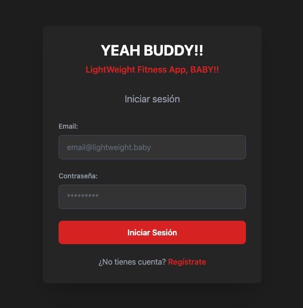

En este ejemplo se empezará por registrar un usuario pulsando en **Regístrate**

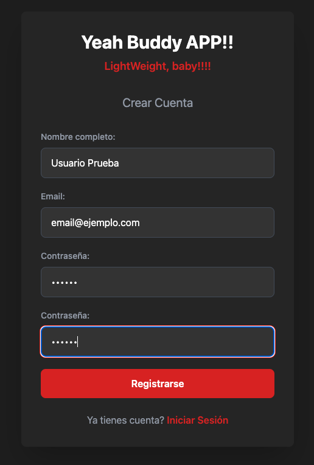

Aunque primero, vamos a forzar un error introduciendo una contraseña y una confirmación diferente:

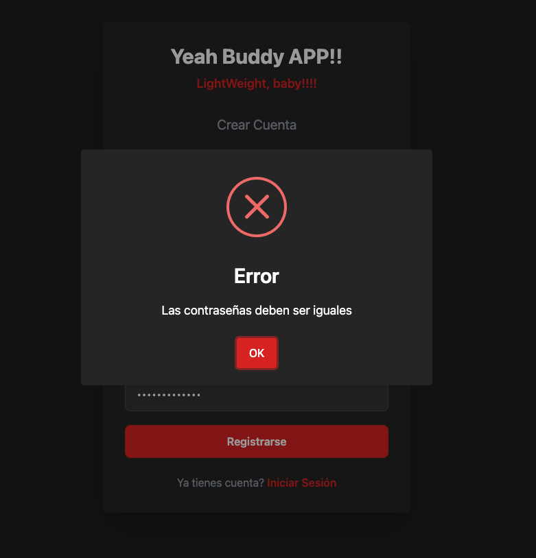

Una vez confirmado el registro, redirige al home:

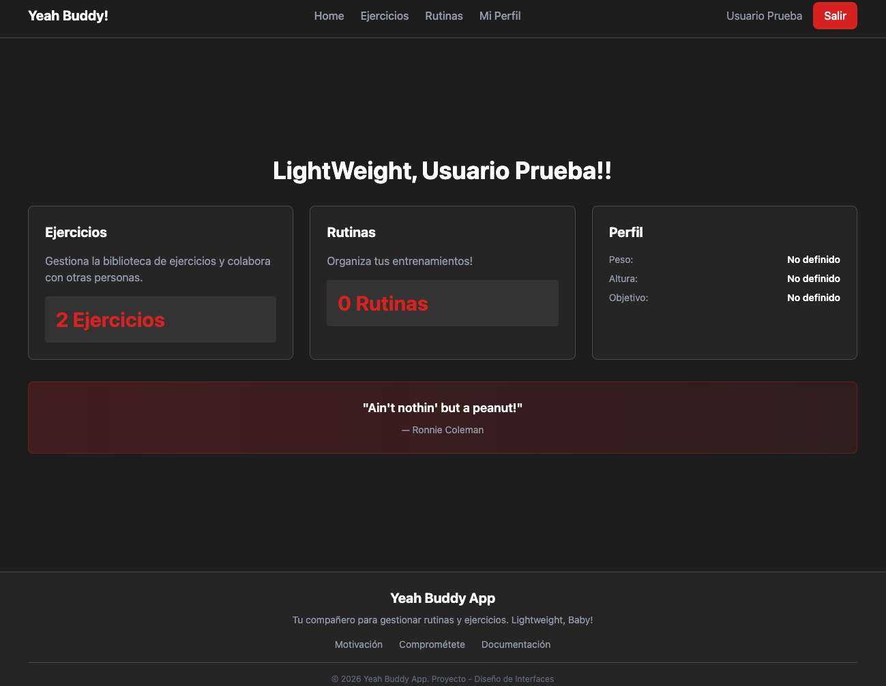

En esta página se puede apreciar un header superior con el nombre de la web (que cumple también como ruta a inicio), un menú con las diferentes rutas, el nombre del usuario y el botón de cerrar sesión. También se tiene un saludo personalizado y debajo las tres tarjetas resumen del usuario:

- Ejercicios: Recordar que esta tarjeta es común para todos los usuarios de la aplicación
- Rutinas: Rutinas por id de usuario
- Perfil: Datos del usuario logueado

Estas tarjetas sirven además como ruta a sus páginas correspondientes, de modo que el usuario tiene dos formas de acceder a las páginas principales.

Seguido a esto un mensaje motivacional y finalmente un footer con enlaces de interés *(no se dará mucha importancia al footer)*

Comencemos por ejercicios, ya sea haciendo click en su tarjeta como en el menú superior. Una vez dentro, la vista es la siguiente:

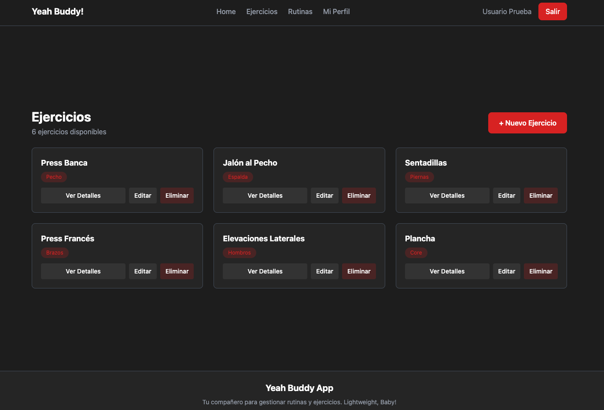

Se puede observar una tarjeta para cada ejercicio. En ella se indica, nombre, grupo muscular y los botones de acción. También como elemento destacable está el botón de crear ejercicio, así que vamos a ello:

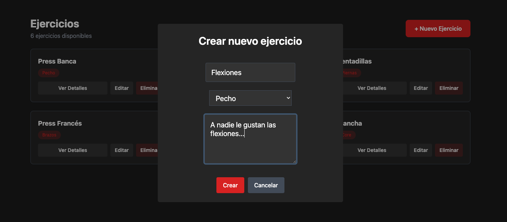

Se abre un modal utilizado con SweetAlert 2 con los campos necesarios para crear un ejercicio. En este caso, se introduce el nombre del ejercicio, el grupo muscular y una descripción. Al confirmar, se muestra un mensaje de éxito y el nuevo ejercicio aparece en la lista:

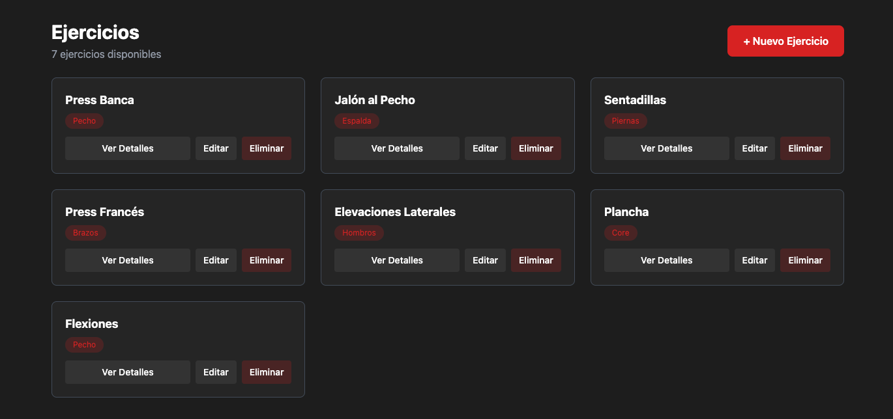

Para saber un poco más del ejercicio, se puede *Ver Detalles*:

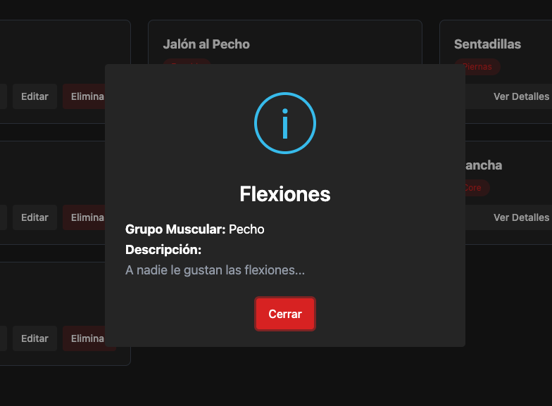

La opción de editar nos vuelve a abrir un modal similar al de creación, pero ya con los campos del ejercicio: 

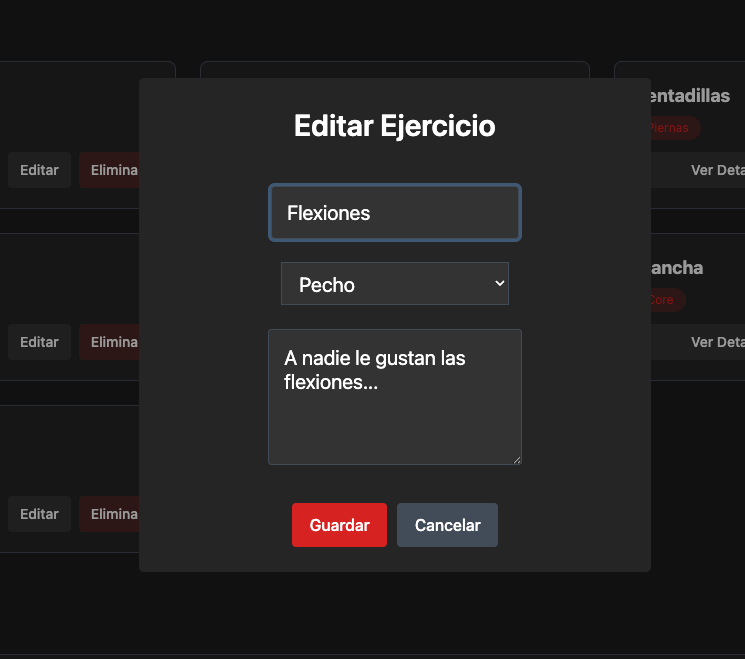

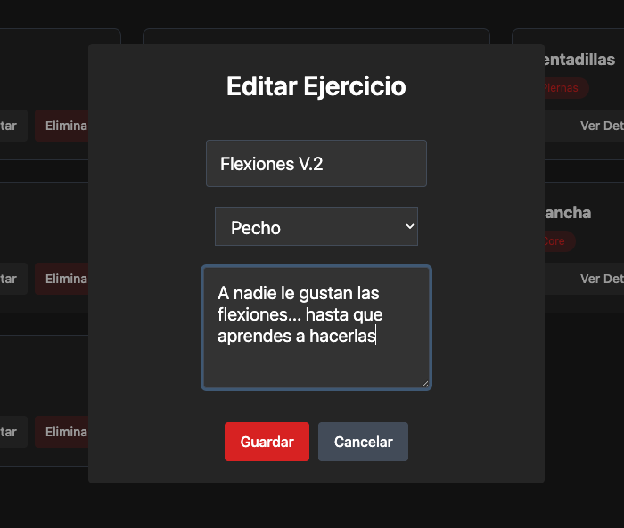

Una vez editado, podemos volver a ver detaller para comprobar los cambios:

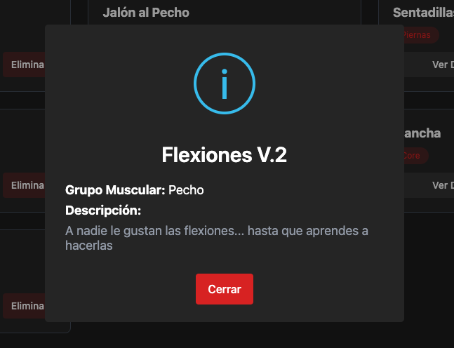

Por último solo quedaría Eliminar el ejercicio. Antes de eliminar, se muestra un modal de confirmación para evitar eliminaciones accidentales:

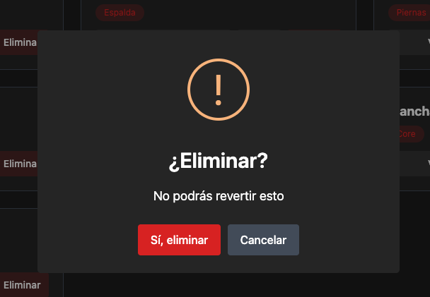

Tras eliminar, se vuelven a mostrar los ejercicios restantes:

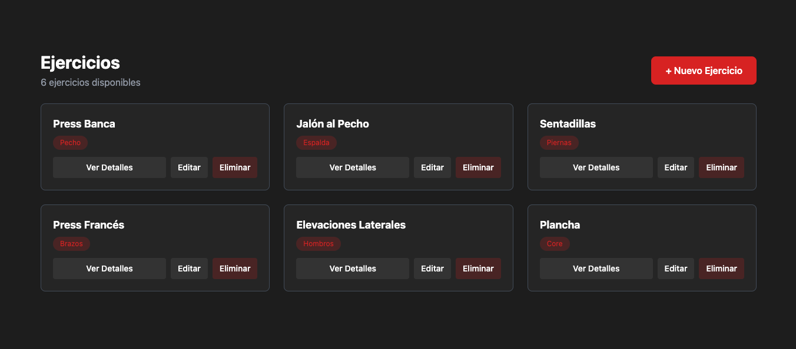


Una vez finalizado con los ejercicios, pasamos a la página de rutinas. Para ello vamos a menú superior y accedemos a **Rutinas** o bien se puede volver al home y picar en su tarjeta. Una vez dentro de la página la vista sería la siguiente:

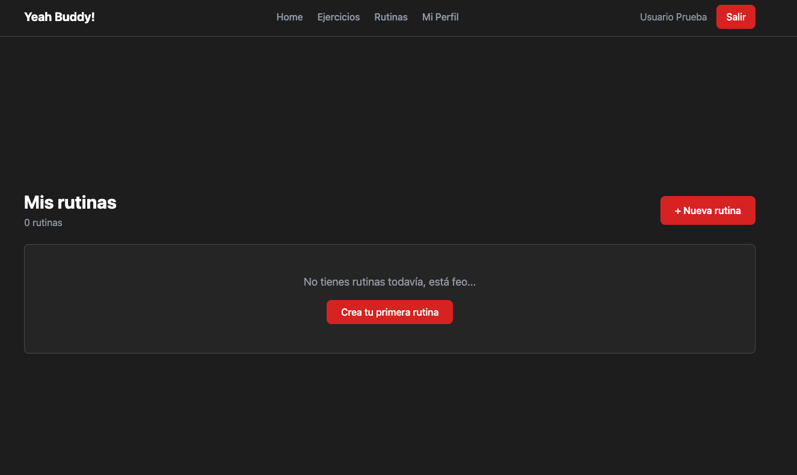

Vaya! Nuestro usuario es nuevo, por lo que no tenemos rutinas creadas. Vamos a crear la primera pulsando el botón de **+ Nueva rutina** o **Crear tu primera rutina**:

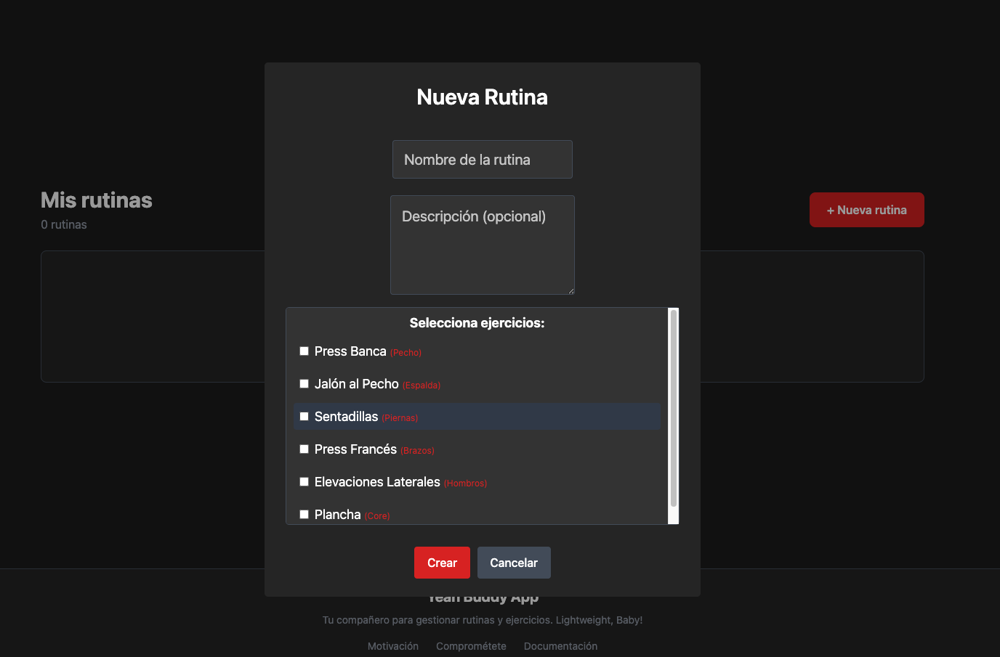

Para crear una rutina se debe introducir un nombre para esta, una descipción opcional y seleccionar los ejercicios deseados:

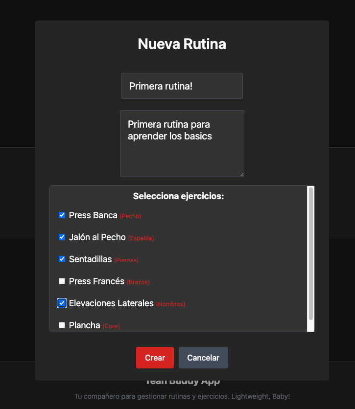

Y ya tendríamos la primera rutina creada, pero para ver la magia, vamos a crear una segunda rutina.

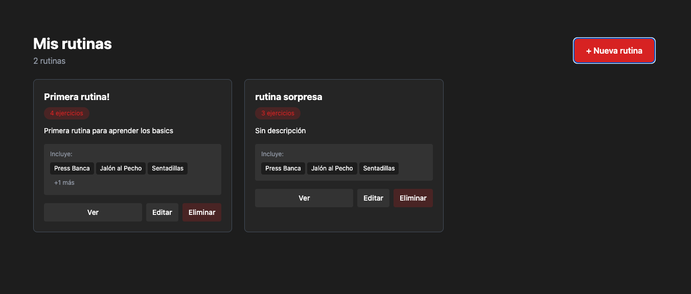

Con el conteo de las rutinas se puede ver que en home el contador ha subido a dos rutinas:

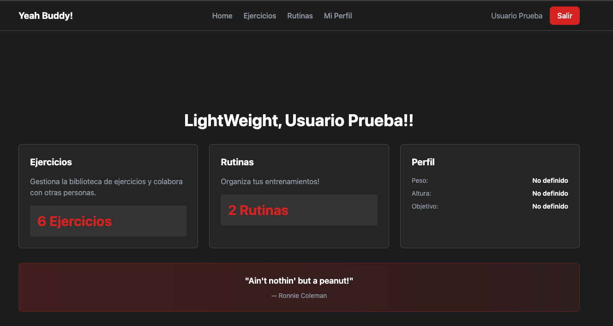